# Music Player - Sequence Diagrams (Biểu đồ Tuần tự)

## Mục lục

1. [Khởi tạo ứng dụng](#1-khởi-tạo-ứng-dụng)
2. [Phát bài hát](#2-phát-bài-hát)
3. [Điều khiển phát nhạc](#3-điều-khiển-phát-nhạc)
4. [Quản lý Favorites](#4-quản-lý-favorites)
5. [Thêm vào Playlist](#5-thêm-vào-playlist)
6. [Tìm kiếm bài hát](#6-tìm-kiếm-bài-hát)
7. [Xem chi tiết nghệ sĩ](#7-xem-chi-tiết-nghệ-sĩ)
8. [Điều khiển từ Lock Screen](#8-điều-khiển-từ-lock-screen)
9. [Mở màn hình Player](#9-mở-màn-hình-player)
10. [Điều chỉnh âm lượng & Repeat](#10-điều-chỉnh-âm-lượng--repeat)

---

## 1. Khởi tạo ứng dụng

### SD01: App Initialization Flow

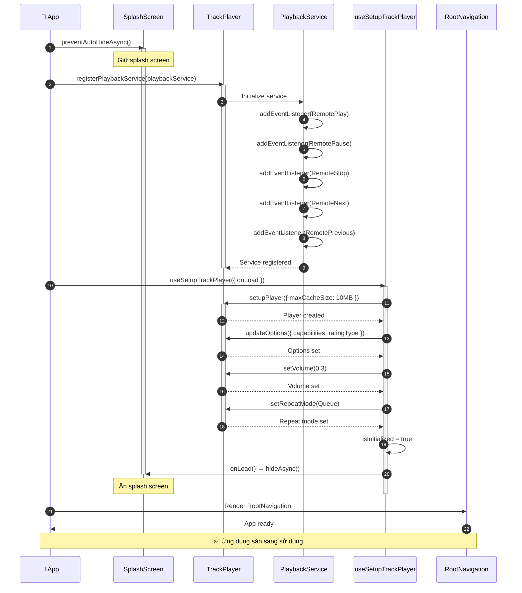
```mermaid
sequenceDiagram
    autonumber
    participant App as 📱 App
    participant Splash as SplashScreen
    participant TP as TrackPlayer
    participant PS as PlaybackService
    participant Hook as useSetupTrackPlayer
    participant UI as RootNavigation

    App->>Splash: preventAutoHideAsync()
    activate Splash
    Note over Splash: Giữ splash screen

    App->>TP: registerPlaybackService(playbackService)
    activate TP
    TP->>PS: Initialize service
    
    PS->>PS: addEventListener(RemotePlay)
    PS->>PS: addEventListener(RemotePause)
    PS->>PS: addEventListener(RemoteStop)
    PS->>PS: addEventListener(RemoteNext)
    PS->>PS: addEventListener(RemotePrevious)
    PS-->>TP: Service registered
    deactivate TP

    App->>Hook: useSetupTrackPlayer({ onLoad })
    activate Hook
    
    Hook->>TP: setupPlayer({ maxCacheSize: 10MB })
    activate TP
    TP-->>Hook: Player created
    
    Hook->>TP: updateOptions({ capabilities, ratingType })
    TP-->>Hook: Options set
    
    Hook->>TP: setVolume(0.3)
    TP-->>Hook: Volume set
    
    Hook->>TP: setRepeatMode(Queue)
    TP-->>Hook: Repeat mode set
    deactivate TP

    Hook->>Hook: isInitialized = true
    Hook->>Splash: onLoad() → hideAsync()
    deactivate Splash
    Note over Splash: Ẩn splash screen
    
    deactivate Hook

    App->>UI: Render RootNavigation
    UI-->>App: App ready
    
    Note over App,UI: ✅ Ứng dụng sẵn sàng sử dụng
```

---

## 2. Phát bài hát

### SD02: Play Track - New Queue

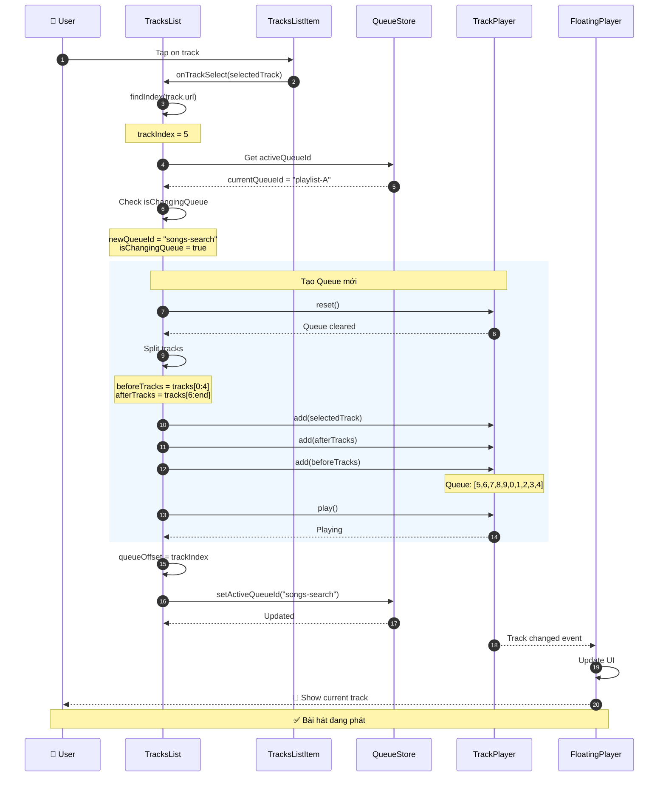
```mermaid
sequenceDiagram
    autonumber
    participant U as 👤 User
    participant TL as TracksList
    participant TLI as TracksListItem
    participant QS as QueueStore
    participant TP as TrackPlayer
    participant FP as FloatingPlayer

    U->>TLI: Tap on track
    TLI->>TL: onTrackSelect(selectedTrack)
    
    TL->>TL: findIndex(track.url)
    Note over TL: trackIndex = 5

    TL->>QS: Get activeQueueId
    QS-->>TL: currentQueueId = "playlist-A"
    
    TL->>TL: Check isChangingQueue
    Note over TL: newQueueId = "songs-search"<br/>isChangingQueue = true

    rect rgb(240, 248, 255)
        Note over TL,TP: Tạo Queue mới
        TL->>TP: reset()
        TP-->>TL: Queue cleared
        
        TL->>TL: Split tracks
        Note over TL: beforeTracks = tracks[0:4]<br/>afterTracks = tracks[6:end]
        
        TL->>TP: add(selectedTrack)
        TL->>TP: add(afterTracks)
        TL->>TP: add(beforeTracks)
        Note over TP: Queue: [5,6,7,8,9,0,1,2,3,4]
        
        TL->>TP: play()
        TP-->>TL: Playing
    end

    TL->>TL: queueOffset = trackIndex
    TL->>QS: setActiveQueueId("songs-search")
    QS-->>TL: Updated

    TP-->>FP: Track changed event
    FP->>FP: Update UI
    FP-->>U: 🎵 Show current track

    Note over U,FP: ✅ Bài hát đang phát
```

### SD03: Play Track - Same Queue

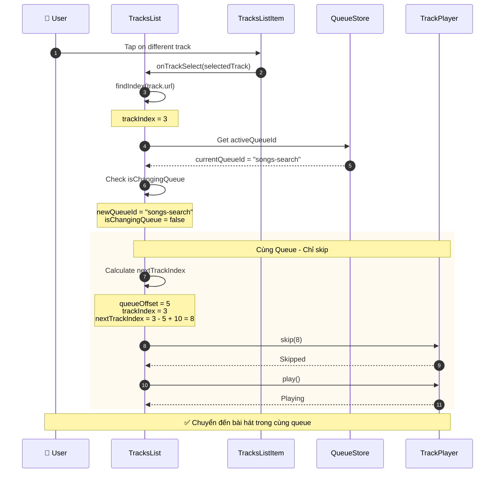
```mermaid
sequenceDiagram
    autonumber
    participant U as 👤 User
    participant TL as TracksList
    participant TLI as TracksListItem
    participant QS as QueueStore
    participant TP as TrackPlayer

    U->>TLI: Tap on different track
    TLI->>TL: onTrackSelect(selectedTrack)
    
    TL->>TL: findIndex(track.url)
    Note over TL: trackIndex = 3

    TL->>QS: Get activeQueueId
    QS-->>TL: currentQueueId = "songs-search"
    
    TL->>TL: Check isChangingQueue
    Note over TL: newQueueId = "songs-search"<br/>isChangingQueue = false

    rect rgb(255, 250, 240)
        Note over TL,TP: Cùng Queue - Chỉ skip
        TL->>TL: Calculate nextTrackIndex
        Note over TL: queueOffset = 5<br/>trackIndex = 3<br/>nextTrackIndex = 3 - 5 + 10 = 8
        
        TL->>TP: skip(8)
        TP-->>TL: Skipped
        
        TL->>TP: play()
        TP-->>TL: Playing
    end

    Note over U,TP: ✅ Chuyển đến bài hát trong cùng queue
```

### SD04: Play All / Shuffle

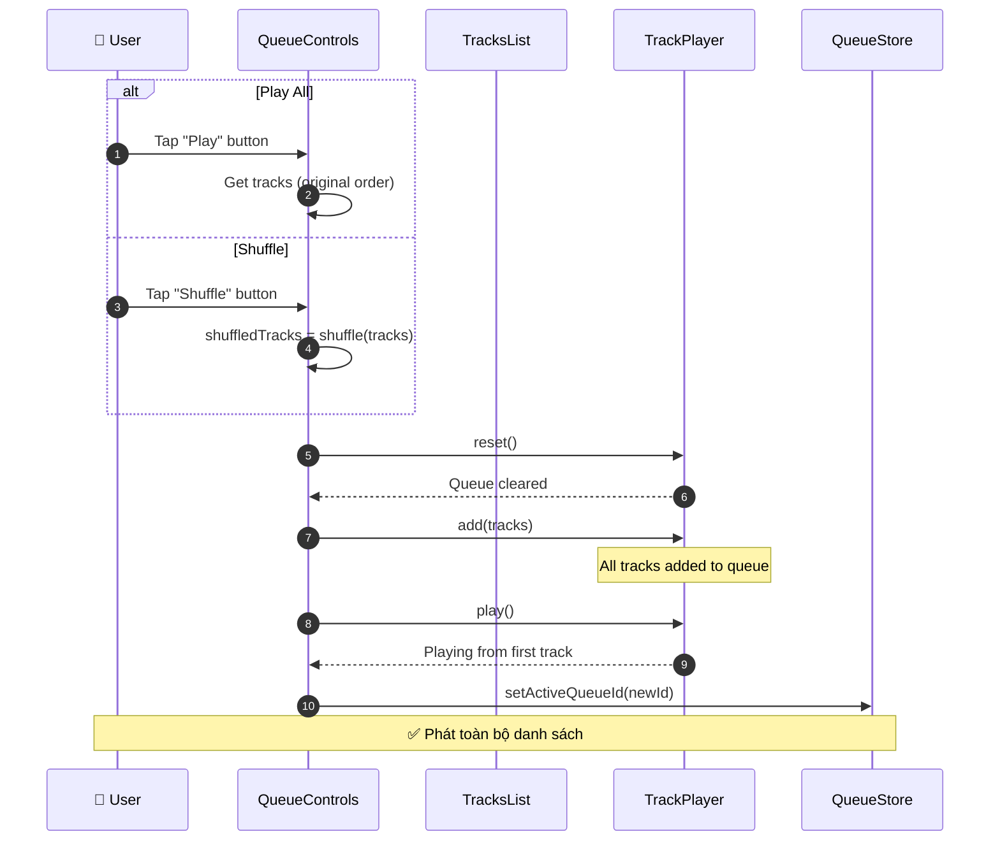
```mermaid
sequenceDiagram
    autonumber
    participant U as 👤 User
    participant QC as QueueControls
    participant TL as TracksList
    participant TP as TrackPlayer
    participant QS as QueueStore

    alt Play All
        U->>QC: Tap "Play" button
        QC->>QC: Get tracks (original order)
    else Shuffle
        U->>QC: Tap "Shuffle" button
        QC->>QC: shuffledTracks = shuffle(tracks)
    end

    QC->>TP: reset()
    TP-->>QC: Queue cleared
    
    QC->>TP: add(tracks)
    Note over TP: All tracks added to queue
    
    QC->>TP: play()
    TP-->>QC: Playing from first track
    
    QC->>QS: setActiveQueueId(newId)
    
    Note over U,QS: ✅ Phát toàn bộ danh sách
```

---

## 3. Điều khiển phát nhạc

### SD05: Play/Pause Toggle

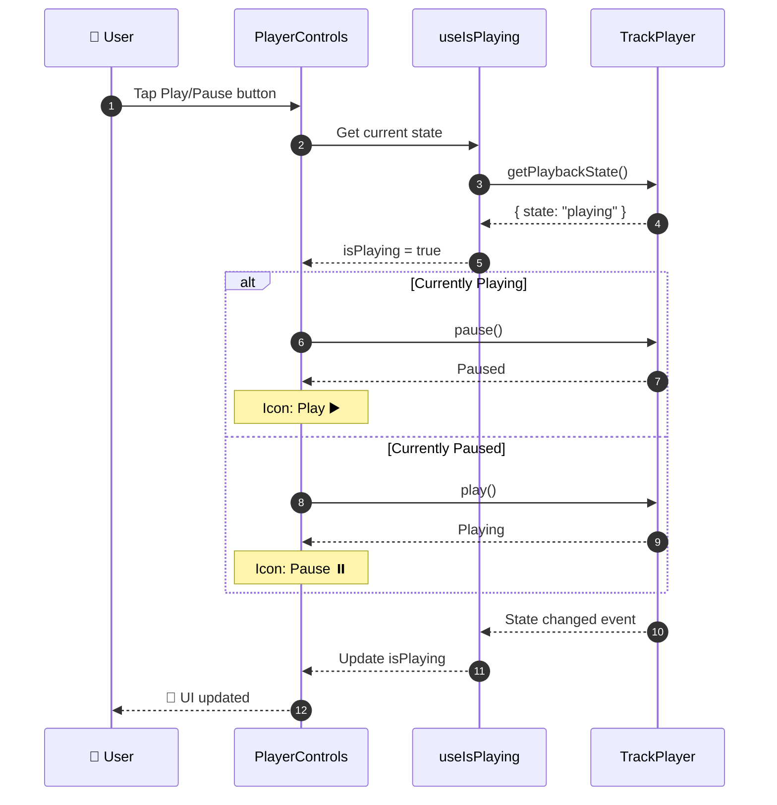
```mermaid
sequenceDiagram
    autonumber
    participant U as 👤 User
    participant PC as PlayerControls
    participant Hook as useIsPlaying
    participant TP as TrackPlayer

    U->>PC: Tap Play/Pause button
    
    PC->>Hook: Get current state
    Hook->>TP: getPlaybackState()
    TP-->>Hook: { state: "playing" }
    Hook-->>PC: isPlaying = true

    alt Currently Playing
        PC->>TP: pause()
        TP-->>PC: Paused
        Note over PC: Icon: Play ▶️
    else Currently Paused
        PC->>TP: play()
        TP-->>PC: Playing
        Note over PC: Icon: Pause ⏸️
    end

    TP-->>Hook: State changed event
    Hook-->>PC: Update isPlaying
    PC-->>U: 🔄 UI updated
```

### SD06: Skip Next / Previous

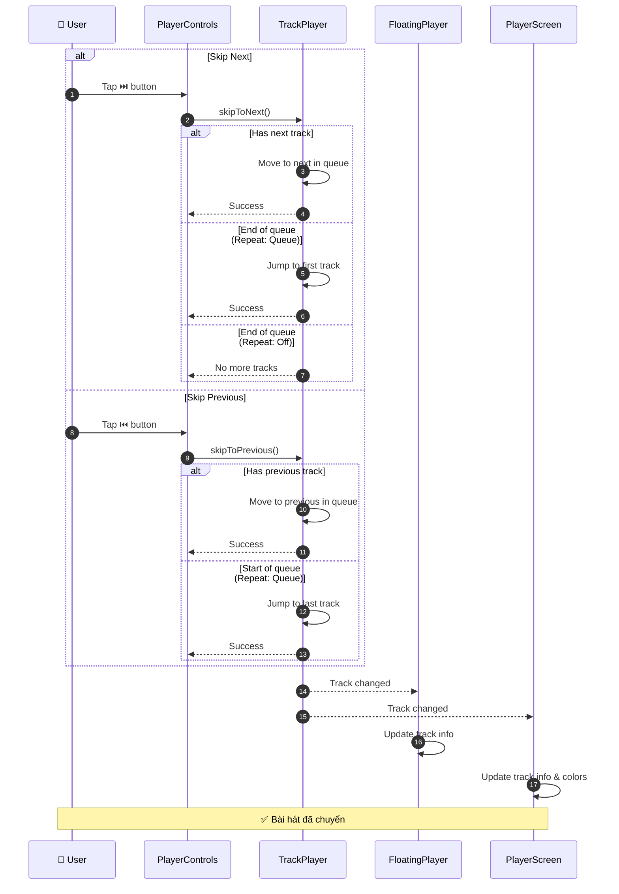
```mermaid
sequenceDiagram
    autonumber
    participant U as 👤 User
    participant PC as PlayerControls
    participant TP as TrackPlayer
    participant FP as FloatingPlayer
    participant PS as PlayerScreen

    alt Skip Next
        U->>PC: Tap ⏭️ button
        PC->>TP: skipToNext()
        
        alt Has next track
            TP->>TP: Move to next in queue
            TP-->>PC: Success
        else End of queue (Repeat: Queue)
            TP->>TP: Jump to first track
            TP-->>PC: Success
        else End of queue (Repeat: Off)
            TP-->>PC: No more tracks
        end
        
    else Skip Previous
        U->>PC: Tap ⏮️ button
        PC->>TP: skipToPrevious()
        
        alt Has previous track
            TP->>TP: Move to previous in queue
            TP-->>PC: Success
        else Start of queue (Repeat: Queue)
            TP->>TP: Jump to last track
            TP-->>PC: Success
        end
    end

    TP-->>FP: Track changed
    TP-->>PS: Track changed
    
    FP->>FP: Update track info
    PS->>PS: Update track info & colors
    
    Note over U,PS: ✅ Bài hát đã chuyển
```

---

## 4. Quản lý Favorites

### SD07: Toggle Favorite từ Player Screen

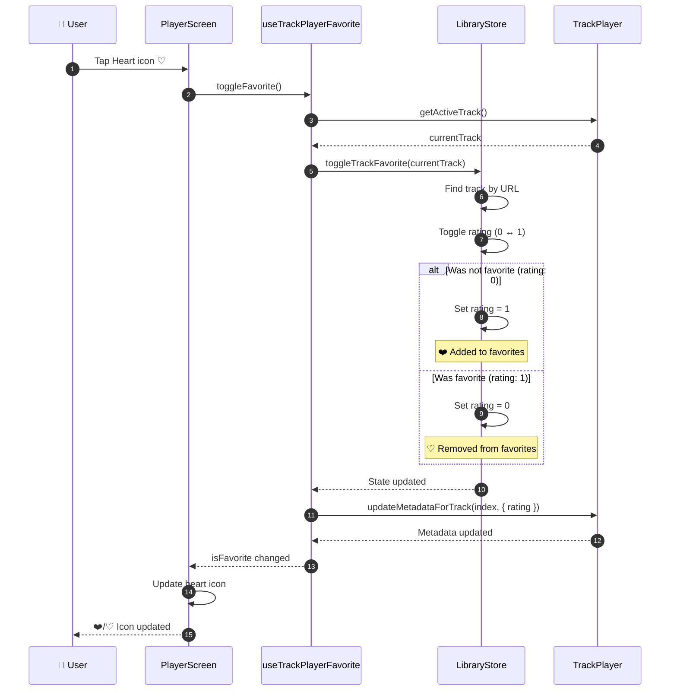
```mermaid
sequenceDiagram
    autonumber
    participant U as 👤 User
    participant PS as PlayerScreen
    participant Hook as useTrackPlayerFavorite
    participant LS as LibraryStore
    participant TP as TrackPlayer

    U->>PS: Tap Heart icon ♡
    PS->>Hook: toggleFavorite()
    
    Hook->>TP: getActiveTrack()
    TP-->>Hook: currentTrack
    
    Hook->>LS: toggleTrackFavorite(currentTrack)
    
    LS->>LS: Find track by URL
    LS->>LS: Toggle rating (0 ↔ 1)
    
    alt Was not favorite (rating: 0)
        LS->>LS: Set rating = 1
        Note over LS: ❤️ Added to favorites
    else Was favorite (rating: 1)
        LS->>LS: Set rating = 0
        Note over LS: ♡ Removed from favorites
    end
    
    LS-->>Hook: State updated
    
    Hook->>TP: updateMetadataForTrack(index, { rating })
    TP-->>Hook: Metadata updated
    
    Hook-->>PS: isFavorite changed
    PS->>PS: Update heart icon
    PS-->>U: ❤️/♡ Icon updated
```

### SD08: Toggle Favorite từ Track Menu

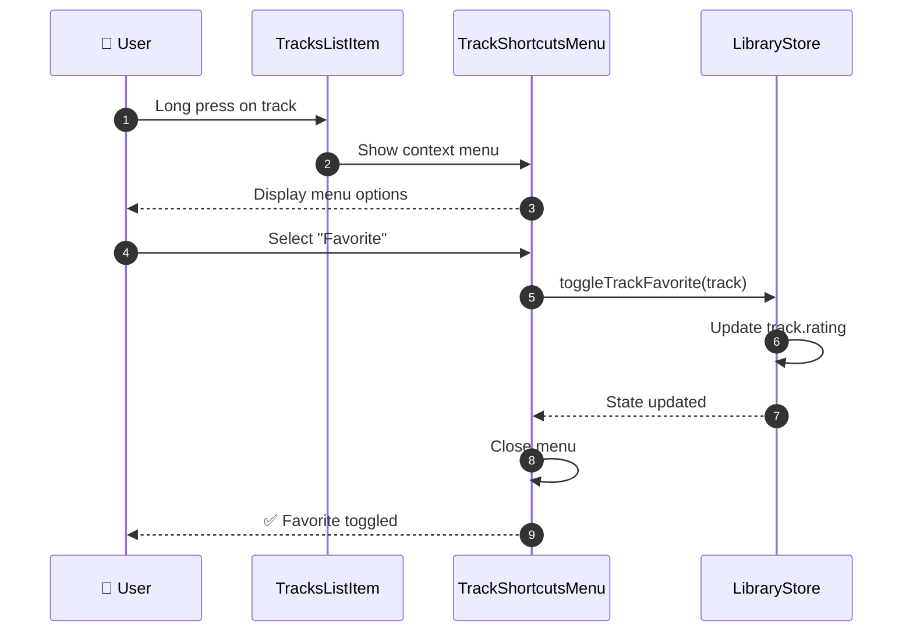
```mermaid
sequenceDiagram
    autonumber
    participant U as 👤 User
    participant TLI as TracksListItem
    participant Menu as TrackShortcutsMenu
    participant LS as LibraryStore

    U->>TLI: Long press on track
    TLI->>Menu: Show context menu
    Menu-->>U: Display menu options

    U->>Menu: Select "Favorite"
    
    Menu->>LS: toggleTrackFavorite(track)
    LS->>LS: Update track.rating
    LS-->>Menu: State updated
    
    Menu->>Menu: Close menu
    Menu-->>U: ✅ Favorite toggled
```

---

## 5. Thêm vào Playlist

### SD09: Add Track to Playlist

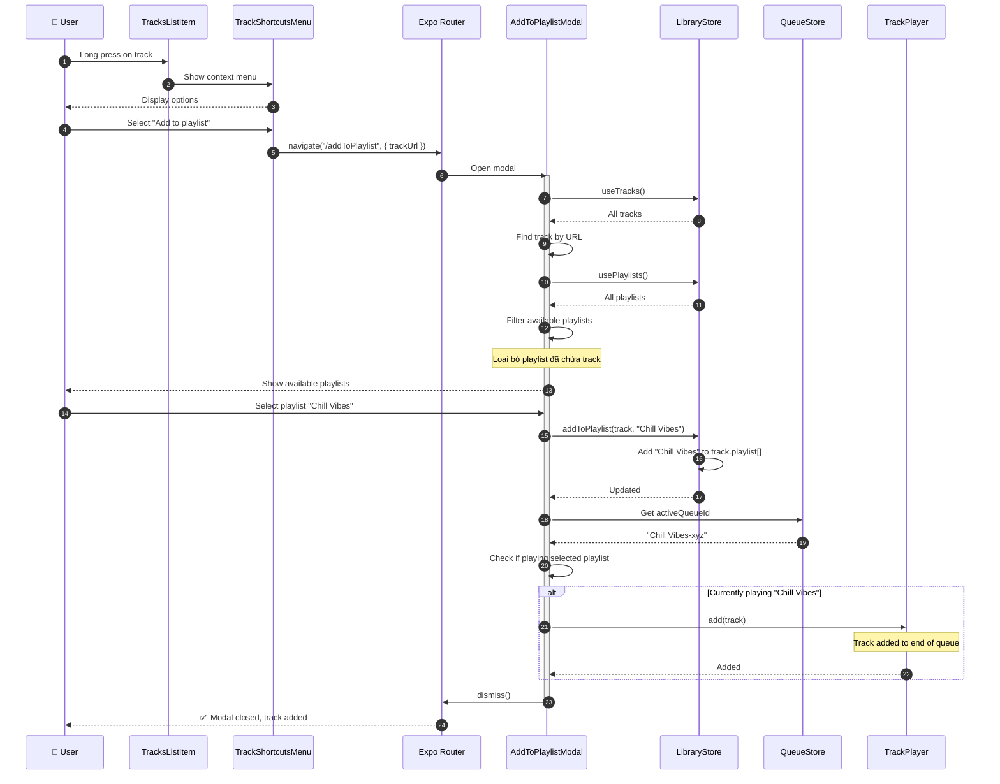
```mermaid
sequenceDiagram
    autonumber
    participant U as 👤 User
    participant TLI as TracksListItem
    participant Menu as TrackShortcutsMenu
    participant Router as Expo Router
    participant Modal as AddToPlaylistModal
    participant LS as LibraryStore
    participant QS as QueueStore
    participant TP as TrackPlayer

    U->>TLI: Long press on track
    TLI->>Menu: Show context menu
    Menu-->>U: Display options

    U->>Menu: Select "Add to playlist"
    Menu->>Router: navigate("/addToPlaylist", { trackUrl })
    
    Router->>Modal: Open modal
    activate Modal
    
    Modal->>LS: useTracks()
    LS-->>Modal: All tracks
    
    Modal->>Modal: Find track by URL
    
    Modal->>LS: usePlaylists()
    LS-->>Modal: All playlists
    
    Modal->>Modal: Filter available playlists
    Note over Modal: Loại bỏ playlist đã chứa track
    
    Modal-->>U: Show available playlists

    U->>Modal: Select playlist "Chill Vibes"
    
    Modal->>LS: addToPlaylist(track, "Chill Vibes")
    LS->>LS: Add "Chill Vibes" to track.playlist[]
    LS-->>Modal: Updated

    Modal->>QS: Get activeQueueId
    QS-->>Modal: "Chill Vibes-xyz"
    
    Modal->>Modal: Check if playing selected playlist
    
    alt Currently playing "Chill Vibes"
        Modal->>TP: add(track)
        Note over TP: Track added to end of queue
        TP-->>Modal: Added
    end

    Modal->>Router: dismiss()
    deactivate Modal
    
    Router-->>U: ✅ Modal closed, track added
```

---

## 6. Tìm kiếm bài hát

### SD10: Search Tracks

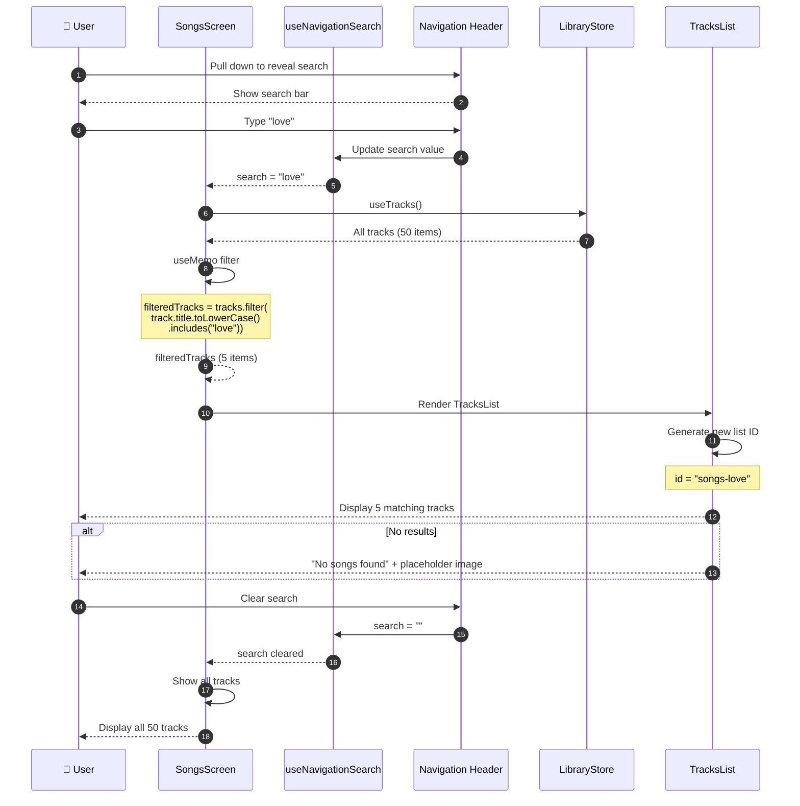
```mermaid
sequenceDiagram
    autonumber
    participant U as 👤 User
    participant Screen as SongsScreen
    participant Hook as useNavigationSearch
    participant Nav as Navigation Header
    participant LS as LibraryStore
    participant TL as TracksList

    U->>Nav: Pull down to reveal search
    Nav-->>U: Show search bar

    U->>Nav: Type "love"
    Nav->>Hook: Update search value
    Hook-->>Screen: search = "love"

    Screen->>LS: useTracks()
    LS-->>Screen: All tracks (50 items)

    Screen->>Screen: useMemo filter
    Note over Screen: filteredTracks = tracks.filter(<br/>track.title.toLowerCase()<br/>.includes("love"))
    
    Screen-->>Screen: filteredTracks (5 items)

    Screen->>TL: Render TracksList
    TL->>TL: Generate new list ID
    Note over TL: id = "songs-love"
    
    TL-->>U: Display 5 matching tracks

    alt No results
        TL-->>U: "No songs found" + placeholder image
    end

    U->>Nav: Clear search
    Nav->>Hook: search = ""
    Hook-->>Screen: search cleared
    Screen->>Screen: Show all tracks
    Screen-->>U: Display all 50 tracks
```

---

## 7. Xem chi tiết nghệ sĩ

### SD11: View Artist Detail

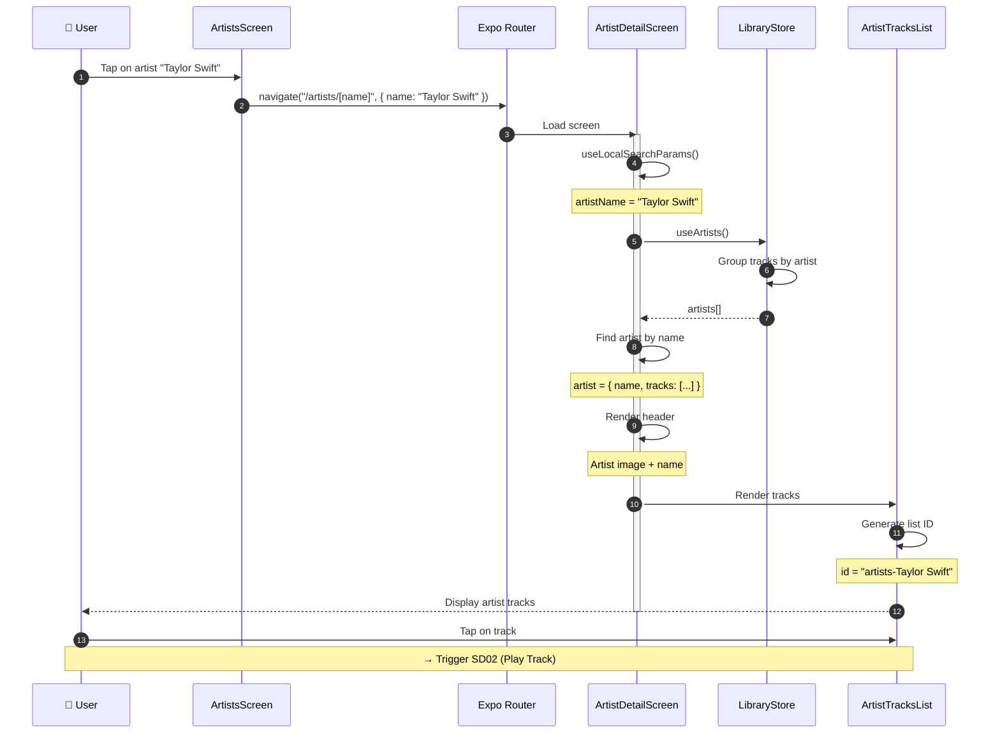
```mermaid
sequenceDiagram
    autonumber
    participant U as 👤 User
    participant AL as ArtistsScreen
    participant Router as Expo Router
    participant AD as ArtistDetailScreen
    participant LS as LibraryStore
    participant TL as ArtistTracksList

    U->>AL: Tap on artist "Taylor Swift"
    AL->>Router: navigate("/artists/[name]", { name: "Taylor Swift" })
    
    Router->>AD: Load screen
    activate AD
    
    AD->>AD: useLocalSearchParams()
    Note over AD: artistName = "Taylor Swift"
    
    AD->>LS: useArtists()
    LS->>LS: Group tracks by artist
    LS-->>AD: artists[]
    
    AD->>AD: Find artist by name
    Note over AD: artist = { name, tracks: [...] }

    AD->>AD: Render header
    Note over AD: Artist image + name

    AD->>TL: Render tracks
    TL->>TL: Generate list ID
    Note over TL: id = "artists-Taylor Swift"
    
    TL-->>U: Display artist tracks
    deactivate AD

    U->>TL: Tap on track
    Note over U,TL: → Trigger SD02 (Play Track)
```

---

## 8. Điều khiển từ Lock Screen

### SD12: Remote Control Events

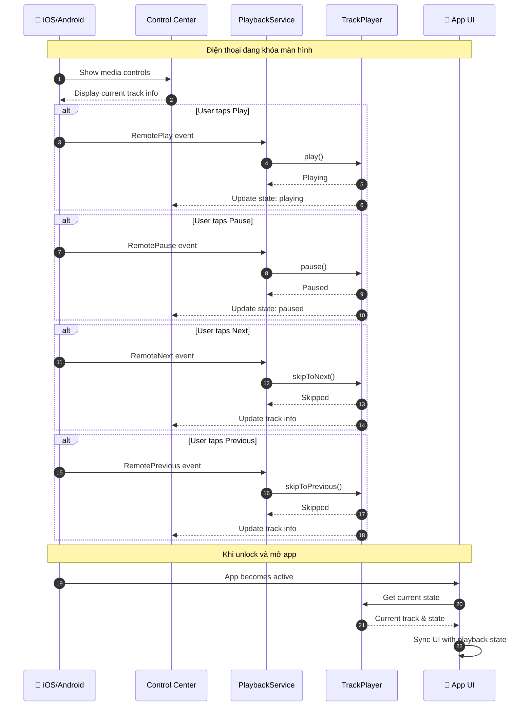
```mermaid
sequenceDiagram
    autonumber
    participant OS as 📱 iOS/Android
    participant CC as Control Center
    participant PS as PlaybackService
    participant TP as TrackPlayer
    participant App as 📱 App UI

    Note over OS,App: Điện thoại đang khóa màn hình

    OS->>CC: Show media controls
    CC-->>OS: Display current track info

    alt User taps Play
        OS->>PS: RemotePlay event
        PS->>TP: play()
        TP-->>PS: Playing
        TP-->>CC: Update state: playing
    end

    alt User taps Pause
        OS->>PS: RemotePause event
        PS->>TP: pause()
        TP-->>PS: Paused
        TP-->>CC: Update state: paused
    end

    alt User taps Next
        OS->>PS: RemoteNext event
        PS->>TP: skipToNext()
        TP-->>PS: Skipped
        TP-->>CC: Update track info
    end

    alt User taps Previous
        OS->>PS: RemotePrevious event
        PS->>TP: skipToPrevious()
        TP-->>PS: Skipped
        TP-->>CC: Update track info
    end

    Note over OS,App: Khi unlock và mở app
    OS->>App: App becomes active
    App->>TP: Get current state
    TP-->>App: Current track & state
    App->>App: Sync UI with playback state
```

---

## 9. Mở màn hình Player

### SD13: Open Player Screen

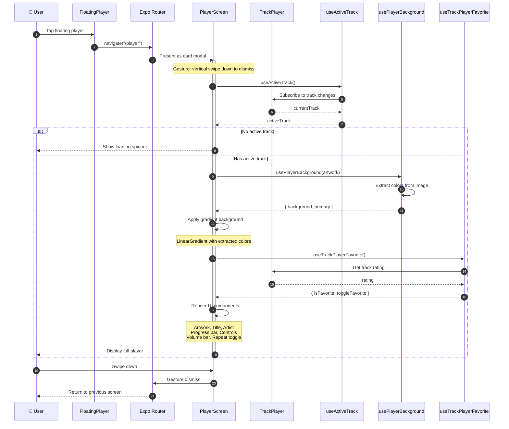
```mermaid
sequenceDiagram
    autonumber
    participant U as 👤 User
    participant FP as FloatingPlayer
    participant Router as Expo Router
    participant PS as PlayerScreen
    participant TP as TrackPlayer
    participant Hook1 as useActiveTrack
    participant Hook2 as usePlayerBackground
    participant Hook3 as useTrackPlayerFavorite

    U->>FP: Tap floating player
    FP->>Router: navigate("/player")
    
    Router->>PS: Present as card modal
    activate PS
    Note over PS: Gesture: vertical swipe down to dismiss

    PS->>Hook1: useActiveTrack()
    Hook1->>TP: Subscribe to track changes
    TP-->>Hook1: currentTrack
    Hook1-->>PS: activeTrack

    alt No active track
        PS-->>U: Show loading spinner
    else Has active track
        PS->>Hook2: usePlayerBackground(artwork)
        Hook2->>Hook2: Extract colors from image
        Hook2-->>PS: { background, primary }
        
        PS->>PS: Apply gradient background
        Note over PS: LinearGradient with extracted colors

        PS->>Hook3: useTrackPlayerFavorite()
        Hook3->>TP: Get track rating
        TP-->>Hook3: rating
        Hook3-->>PS: { isFavorite, toggleFavorite }

        PS->>PS: Render UI components
        Note over PS: Artwork, Title, Artist<br/>Progress bar, Controls<br/>Volume bar, Repeat toggle

        PS-->>U: Display full player
    end
    deactivate PS

    U->>PS: Swipe down
    PS->>Router: Gesture dismiss
    Router-->>U: Return to previous screen
```

---

## 10. Điều chỉnh âm lượng & Repeat

### SD14: Adjust Volume

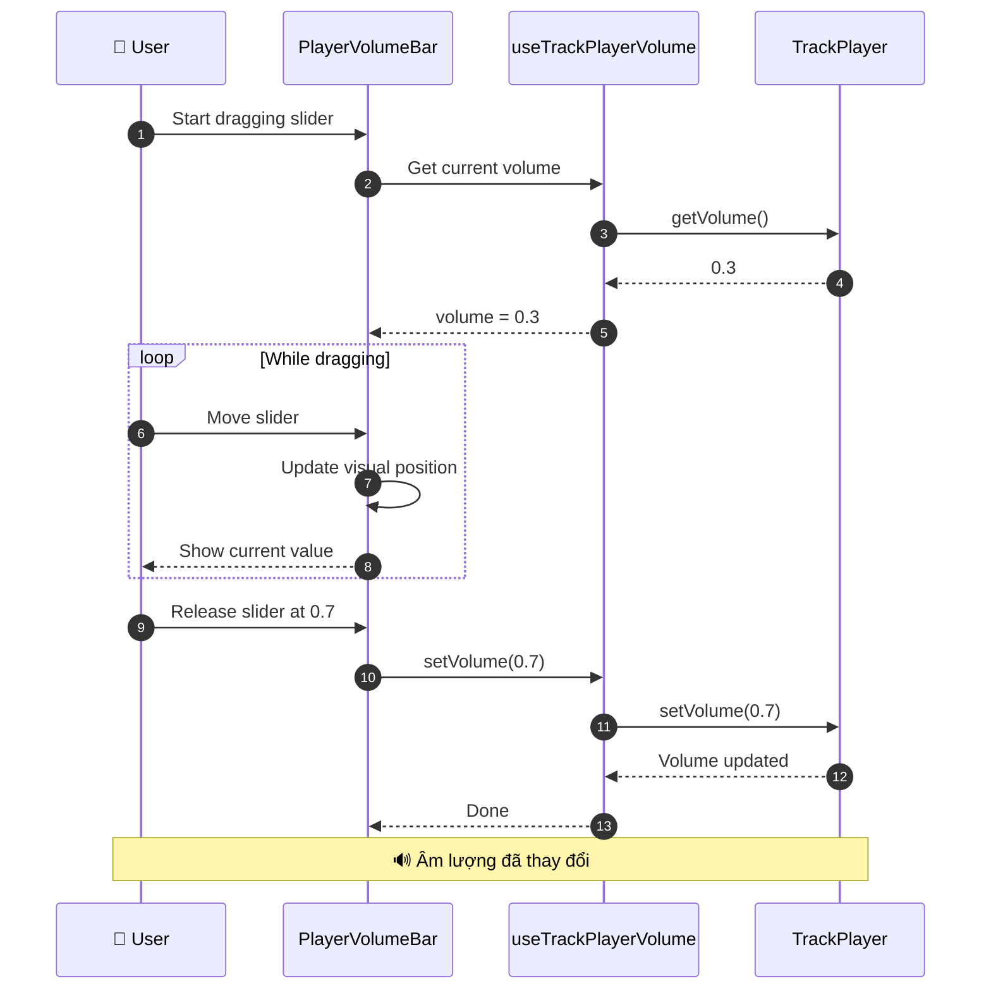
```mermaid
sequenceDiagram
    autonumber
    participant U as 👤 User
    participant VB as PlayerVolumeBar
    participant Hook as useTrackPlayerVolume
    participant TP as TrackPlayer

    U->>VB: Start dragging slider
    
    VB->>Hook: Get current volume
    Hook->>TP: getVolume()
    TP-->>Hook: 0.3
    Hook-->>VB: volume = 0.3

    loop While dragging
        U->>VB: Move slider
        VB->>VB: Update visual position
        VB-->>U: Show current value
    end

    U->>VB: Release slider at 0.7
    VB->>Hook: setVolume(0.7)
    Hook->>TP: setVolume(0.7)
    TP-->>Hook: Volume updated
    Hook-->>VB: Done

    Note over U,TP: 🔊 Âm lượng đã thay đổi
```

### SD15: Toggle Repeat Mode

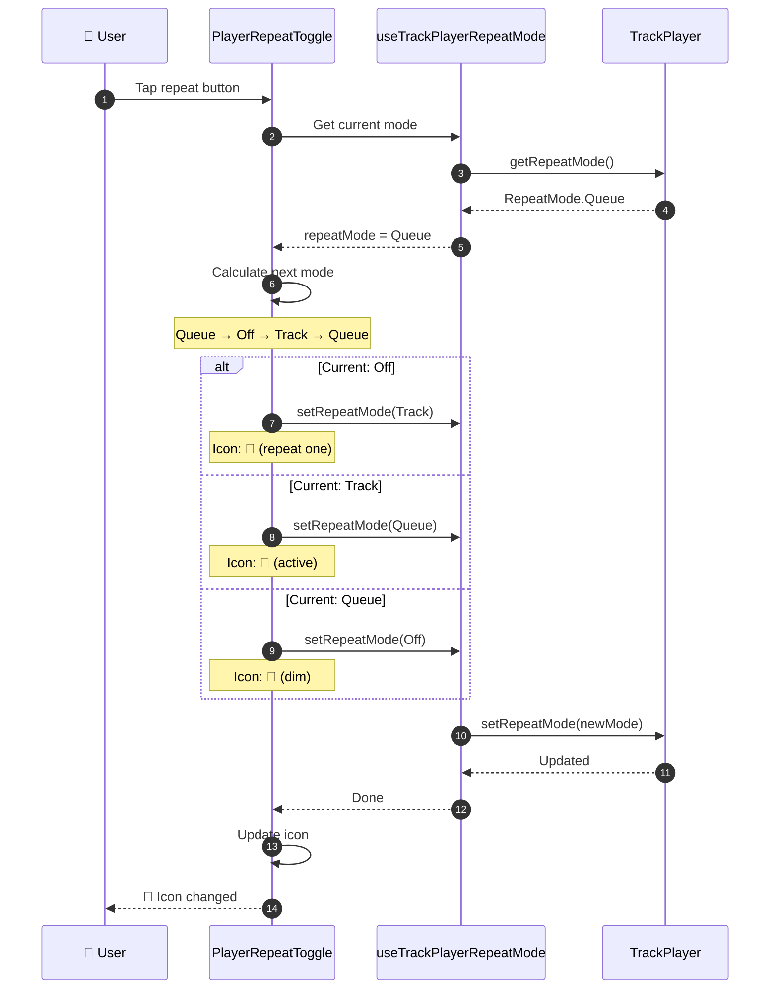
```mermaid
sequenceDiagram
    autonumber
    participant U as 👤 User
    participant RT as PlayerRepeatToggle
    participant Hook as useTrackPlayerRepeatMode
    participant TP as TrackPlayer

    U->>RT: Tap repeat button
    
    RT->>Hook: Get current mode
    Hook->>TP: getRepeatMode()
    TP-->>Hook: RepeatMode.Queue
    Hook-->>RT: repeatMode = Queue

    RT->>RT: Calculate next mode
    Note over RT: Queue → Off → Track → Queue

    alt Current: Off
        RT->>Hook: setRepeatMode(Track)
        Note over RT: Icon: 🔂 (repeat one)
    else Current: Track
        RT->>Hook: setRepeatMode(Queue)
        Note over RT: Icon: 🔁 (active)
    else Current: Queue
        RT->>Hook: setRepeatMode(Off)
        Note over RT: Icon: 🔁 (dim)
    end

    Hook->>TP: setRepeatMode(newMode)
    TP-->>Hook: Updated
    Hook-->>RT: Done

    RT->>RT: Update icon
    RT-->>U: 🔄 Icon changed
```

---

## Tổng hợp các Sequence Diagrams

| ID | Tên | Mô tả |
|----|-----|-------|
| SD01 | App Initialization | Khởi tạo app, TrackPlayer, PlaybackService |
| SD02 | Play Track - New Queue | Phát bài hát, tạo queue mới |
| SD03 | Play Track - Same Queue | Phát bài hát trong cùng queue |
| SD04 | Play All / Shuffle | Phát tất cả hoặc ngẫu nhiên |
| SD05 | Play/Pause Toggle | Bật/tắt phát nhạc |
| SD06 | Skip Next/Previous | Chuyển bài tiếp/trước |
| SD07 | Toggle Favorite (Player) | Yêu thích từ màn hình Player |
| SD08 | Toggle Favorite (Menu) | Yêu thích từ context menu |
| SD09 | Add to Playlist | Thêm bài hát vào playlist |
| SD10 | Search Tracks | Tìm kiếm bài hát |
| SD11 | View Artist Detail | Xem chi tiết nghệ sĩ |
| SD12 | Remote Control | Điều khiển từ lock screen |
| SD13 | Open Player Screen | Mở màn hình phát nhạc |
| SD14 | Adjust Volume | Điều chỉnh âm lượng |
| SD15 | Toggle Repeat Mode | Chuyển đổi chế độ lặp |

---

## Hướng dẫn đọc Sequence Diagram

### Ký hiệu cơ bản

| Ký hiệu | Ý nghĩa |
|---------|---------|
| `→` (solid arrow) | Synchronous message (gọi hàm) |
| `-->>` (dashed arrow) | Return message (trả về) |
| `activate/deactivate` | Thời gian hoạt động của participant |
| `alt/else` | Điều kiện rẽ nhánh |
| `loop` | Vòng lặp |
| `rect` | Nhóm các bước liên quan |
| `Note` | Ghi chú giải thích |
| `autonumber` | Đánh số thứ tự tự động |

### Participants thường gặp

| Icon | Participant | Vai trò |
|------|-------------|---------|
| 👤 | User | Người dùng |
| 📱 | App/Screen | Màn hình ứng dụng |
| 🪝 | Hook | Custom React Hook |
| 🗄️ | Store | Zustand Store |
| 🎵 | TrackPlayer | Audio Engine |

---

*Generated for Music Player React Native Project*

