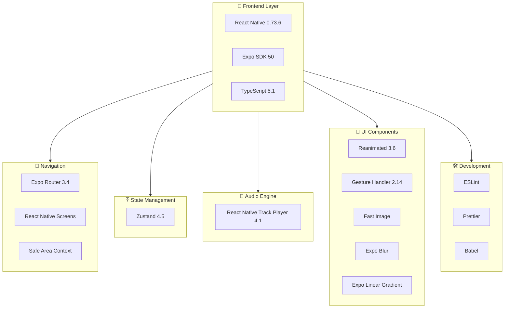
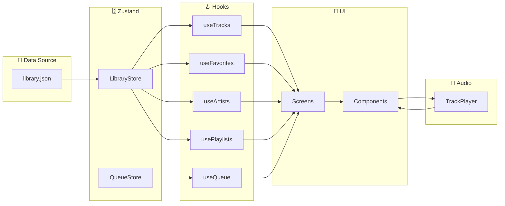

# Music Player - Tech Stack Documentation

## Tổng quan

Ứng dụng Music Player được xây dựng trên nền tảng **React Native** với **Expo**, sử dụng kiến trúc hiện đại và các thư viện phổ biến nhất trong hệ sinh thái React Native.

---

## 🏗️ Kiến trúc Tổng quan



---

## 📦 Core Technologies

### 1. React Native
| Thuộc tính | Giá trị |
|------------|---------|
| **Version** | 0.73.6 |
| **Mô tả** | Framework xây dựng ứng dụng mobile đa nền tảng |
| **Website** | https://reactnative.dev |

**Tại sao chọn React Native?**
- ✅ Cross-platform: iOS & Android từ một codebase
- ✅ Hot Reload: Phát triển nhanh
- ✅ Native Performance: Hiệu năng gần như native
- ✅ Hệ sinh thái lớn: Nhiều thư viện hỗ trợ

---

### 2. Expo
| Thuộc tính | Giá trị |
|------------|---------|
| **Version** | SDK 50.0.14 |
| **Mô tả** | Framework và platform cho React Native |
| **Website** | https://expo.dev |

**Các module Expo sử dụng:**
| Package | Version | Chức năng |
|---------|---------|-----------|
| `expo` | ~50.0.14 | Core SDK |
| `expo-router` | ~3.4.8 | File-based routing |
| `expo-blur` | ~12.9.2 | Hiệu ứng blur |
| `expo-linear-gradient` | ~12.7.2 | Gradient backgrounds |
| `expo-status-bar` | ~1.11.1 | Status bar control |
| `expo-constants` | ~15.4.5 | App constants |
| `expo-linking` | ~6.2.2 | Deep linking |
| `expo-dev-client` | ~3.3.11 | Development client |

---

### 3. TypeScript
| Thuộc tính | Giá trị |
|------------|---------|
| **Version** | 5.1.3 |
| **Mô tả** | JavaScript với static typing |
| **Config** | Strict mode enabled |

**Cấu hình TypeScript:**
```json
{
  "compilerOptions": {
    "strict": true,
    "target": "ES6",
    "jsx": "react-native",
    "paths": {
      "@/*": ["./src/*"],
      "@/assets/*": ["./assets/*"]
    }
  }
}
```

---

## 🧭 Navigation

### Expo Router
| Thuộc tính | Giá trị |
|------------|---------|
| **Version** | 3.4.8 |
| **Mô tả** | File-based routing cho React Native |
| **Pattern** | Dựa trên cấu trúc thư mục |

**Cấu trúc Navigation:**
```
src/app/
├── _layout.tsx          # Root layout (Stack Navigator)
├── player.tsx           # Player screen (Card modal)
├── (tabs)/              # Tab Navigator
│   ├── _layout.tsx      # Tab layout
│   ├── favorites/       # Favorites tab
│   ├── playlists/       # Playlists tab
│   ├── (songs)/         # Songs tab
│   └── artists/         # Artists tab
└── (modals)/            # Modal screens
    └── addToPlaylist.tsx
```

**Tính năng:**
- ✅ File-based routing
- ✅ Typed routes (experimental)
- ✅ Nested navigators
- ✅ Deep linking support

### Supporting Libraries
| Package | Version | Chức năng |
|---------|---------|-----------|
| `react-native-screens` | ~3.29.0 | Native navigation containers |
| `react-native-safe-area-context` | 4.8.2 | Safe area handling |
| `react-native-gesture-handler` | ~2.14.0 | Gesture recognition |

---

## 🗄️ State Management

### Zustand
| Thuộc tính | Giá trị |
|------------|---------|
| **Version** | 4.5.2 |
| **Mô tả** | Lightweight state management |
| **Website** | https://zustand-demo.pmnd.rs |

**Tại sao chọn Zustand?**
- ✅ Nhẹ (~1KB gzipped)
- ✅ API đơn giản, không boilerplate
- ✅ TypeScript support tốt
- ✅ Không cần Provider wrapper
- ✅ Selectors tự động optimize re-renders

**Stores trong dự án:**

```typescript
// Library Store
interface LibraryState {
  tracks: TrackWithPlaylist[]
  toggleTrackFavorite: (track: Track) => void
  addToPlaylist: (track: Track, playlistName: string) => void
}

// Queue Store
interface QueueStore {
  activeQueueId: string | null
  setActiveQueueId: (id: string) => void
}
```

**So sánh với các giải pháp khác:**
| Feature | Zustand | Redux | Context API |
|---------|---------|-------|-------------|
| Bundle size | ~1KB | ~7KB | 0 |
| Boilerplate | Minimal | High | Medium |
| Learning curve | Easy | Steep | Easy |
| DevTools | Yes | Yes | Limited |
| Performance | Excellent | Good | Can be slow |

---

## 🎵 Audio Engine

### React Native Track Player
| Thuộc tính | Giá trị |
|------------|---------|
| **Version** | 4.1.1 |
| **Mô tả** | Full-featured audio player |
| **Website** | https://react-native-track-player.js.org |

**Tính năng chính:**
- ✅ Background playback
- ✅ Lock screen controls
- ✅ Queue management
- ✅ Remote control events
- ✅ Streaming support
- ✅ Caching (10MB configured)

**Capabilities đã cấu hình:**
```typescript
capabilities: [
  Capability.Play,
  Capability.Pause,
  Capability.SkipToNext,
  Capability.SkipToPrevious,
  Capability.Stop,
]
```

**Playback Service Events:**
| Event | Handler |
|-------|---------|
| `RemotePlay` | TrackPlayer.play() |
| `RemotePause` | TrackPlayer.pause() |
| `RemoteStop` | TrackPlayer.stop() |
| `RemoteNext` | TrackPlayer.skipToNext() |
| `RemotePrevious` | TrackPlayer.skipToPrevious() |

---

## 🎨 UI Libraries

### React Native Reanimated
| Thuộc tính | Giá trị |
|------------|---------|
| **Version** | 3.6.2 |
| **Mô tả** | High-performance animations |
| **Use case** | Moving text, transitions |

### React Native Gesture Handler
| Thuộc tính | Giá trị |
|------------|---------|
| **Version** | 2.14.0 |
| **Mô tả** | Native gesture handling |
| **Use case** | Swipe gestures, pan |

### React Native Fast Image
| Thuộc tính | Giá trị |
|------------|---------|
| **Version** | 8.6.3 |
| **Mô tả** | Performance image component |
| **Features** | Caching, priority loading |

### React Native Awesome Slider
| Thuộc tính | Giá trị |
|------------|---------|
| **Version** | 2.5.1 |
| **Mô tả** | Customizable slider component |
| **Use case** | Volume bar, progress bar |

### React Native Image Colors
| Thuộc tính | Giá trị |
|------------|---------|
| **Version** | 2.4.0 |
| **Mô tả** | Extract colors from images |
| **Use case** | Dynamic player background |

### @react-native-menu/menu
| Thuộc tính | Giá trị |
|------------|---------|
| **Version** | 0.9.1 |
| **Mô tả** | Native context menu |
| **Use case** | Track shortcuts menu |

### ts-pattern
| Thuộc tính | Giá trị |
|------------|---------|
| **Version** | 5.0.8 |
| **Mô tả** | Pattern matching for TypeScript |
| **Use case** | Repeat mode handling |

---

## 🛠️ Development Tools

### ESLint
| Thuộc tính | Giá trị |
|------------|---------|
| **Version** | 8.57.0 |
| **Plugins** | @typescript-eslint, react, react-hooks |

### Prettier
| Thuộc tính | Giá trị |
|------------|---------|
| **Version** | 3.2.5 |
| **Mô tả** | Code formatter |

### Babel
| Thuộc tính | Giá trị |
|------------|---------|
| **Version** | 7.20.0 |
| **Preset** | babel-preset-expo |

---

## 📱 Platform Configuration

### iOS
```json
{
  "bundleIdentifier": "com.music.player",
  "supportsTablet": true,
  "infoPlist": {
    "UIBackgroundModes": ["audio"]
  }
}
```

### Android
```json
{
  "adaptiveIcon": {
    "foregroundImage": "./assets/adaptive-icon.png",
    "backgroundColor": "#000"
  }
}
```

---

## 📁 Cấu trúc Dự án

```
music-player/
├── 📁 src/
│   ├── 📁 app/              # Screens & Navigation (Expo Router)
│   ├── 📁 components/       # Reusable UI Components
│   ├── 📁 constants/        # App constants & config
│   ├── 📁 helpers/          # Utility functions & types
│   ├── 📁 hooks/            # Custom React hooks
│   ├── 📁 store/            # Zustand stores
│   ├── 📁 styles/           # Global styles
│   └── 📁 types/            # TypeScript type definitions
├── 📁 assets/
│   ├── 📁 data/             # JSON data files
│   └── 📄 images            # App images
├── 📁 ios/                  # iOS native code
├── 📄 package.json
├── 📄 tsconfig.json
├── 📄 babel.config.js
└── 📄 app.json              # Expo configuration
```

---

## 🔄 Data Flow Architecture



---

## 📊 Dependencies Summary

### Production Dependencies (14)
| Category | Packages |
|----------|----------|
| Core | react, react-native, expo |
| Navigation | expo-router, react-native-screens, react-native-safe-area-context |
| State | zustand |
| Audio | react-native-track-player |
| UI | expo-blur, expo-linear-gradient, react-native-reanimated, react-native-gesture-handler, react-native-fast-image, react-native-awesome-slider |
| Utils | react-native-image-colors, @react-native-menu/menu, ts-pattern |

### Dev Dependencies (8)
| Category | Packages |
|----------|----------|
| TypeScript | typescript, @types/react |
| Linting | eslint, @typescript-eslint/eslint-plugin, @typescript-eslint/parser, eslint-plugin-react, eslint-plugin-react-hooks |
| Formatting | prettier |
| Build | @babel/core |

---

## 🚀 Performance Optimizations

1. **Image Caching**: FastImage với priority loading
2. **Audio Caching**: 10MB cache size cho TrackPlayer
3. **State Selectors**: Zustand selectors tự động memo
4. **Native Animations**: Reanimated chạy trên UI thread
5. **Lazy Loading**: Expo Router code splitting
6. **Blur Effects**: Native blur với expo-blur

---

## 📚 Tài liệu tham khảo

| Công nghệ | Documentation |
|-----------|---------------|
| React Native | https://reactnative.dev/docs/getting-started |
| Expo | https://docs.expo.dev |
| Expo Router | https://docs.expo.dev/router/introduction |
| Zustand | https://docs.pmnd.rs/zustand/getting-started/introduction |
| Track Player | https://react-native-track-player.js.org |
| Reanimated | https://docs.swmansion.com/react-native-reanimated |
| TypeScript | https://www.typescriptlang.org/docs |

---

*Generated for Music Player React Native Project*

