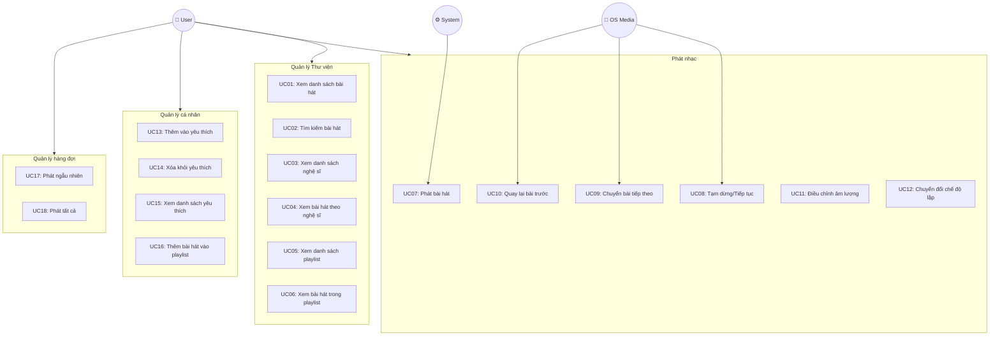
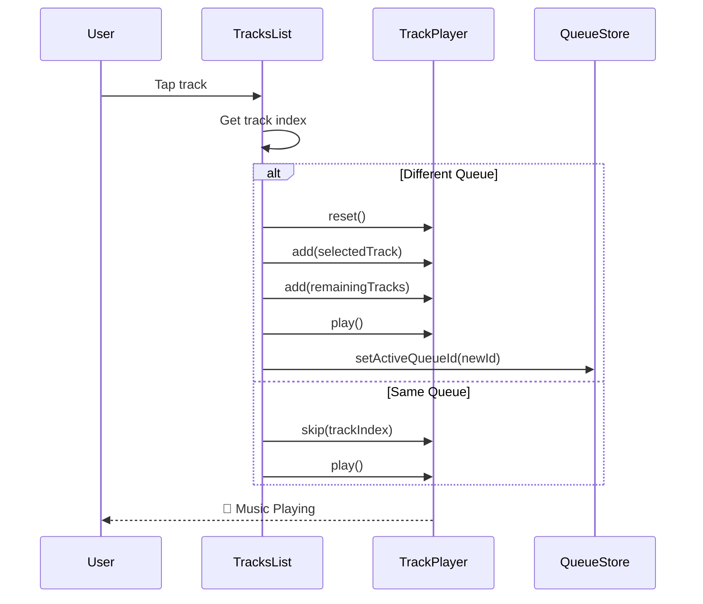
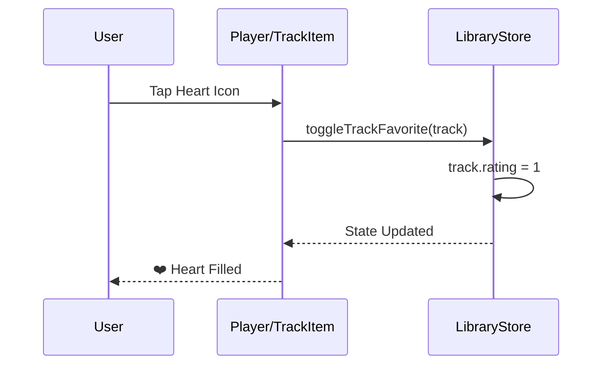
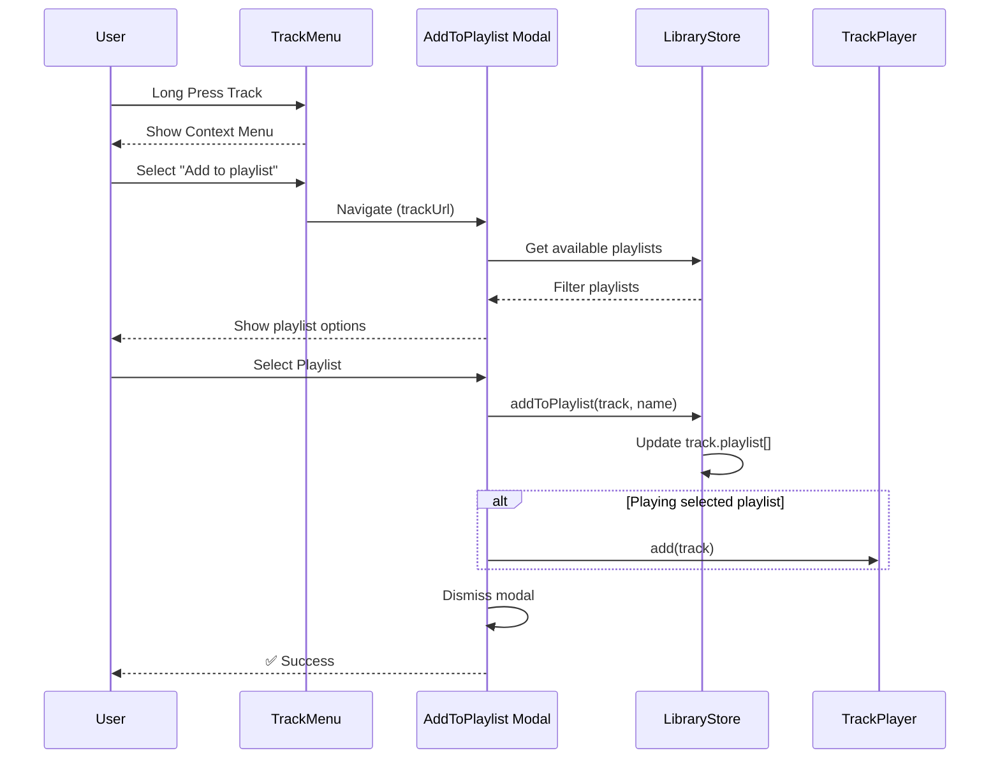

# Music Player - Use Case Specification

## Tổng quan hệ thống

### Actors (Tác nhân)
| Actor | Mô tả |
|-------|-------|
| **User** | Người dùng sử dụng ứng dụng để nghe nhạc |
| **System** | Hệ thống xử lý phát nhạc (TrackPlayer) |
| **OS Media Control** | Điều khiển media từ hệ điều hành (Lock Screen, Control Center) |

### Use Case Diagram

---

## Chi tiết Use Cases

---

### UC01: Xem danh sách bài hát

| Thuộc tính | Mô tả |
|------------|-------|
| **Use Case ID** | UC01 |
| **Tên** | Xem danh sách bài hát |
| **Actor** | User |
| **Mô tả** | Người dùng xem toàn bộ danh sách bài hát trong thư viện |
| **Tiền điều kiện** | Ứng dụng đã khởi động thành công |
| **Hậu điều kiện** | Danh sách bài hát được hiển thị |

**Luồng chính:**
1. User mở tab "Songs" trên thanh điều hướng
2. System lấy danh sách tracks từ Library Store
3. System hiển thị danh sách bài hát với thông tin: ảnh bìa, tên bài, tên nghệ sĩ
4. User cuộn để xem thêm bài hát

**Luồng thay thế:**
- **4a.** Không có bài hát nào:
  - System hiển thị thông báo "No songs found"
  - System hiển thị hình ảnh placeholder

---

### UC02: Tìm kiếm bài hát

| Thuộc tính | Mô tả |
|------------|-------|
| **Use Case ID** | UC02 |
| **Tên** | Tìm kiếm bài hát |
| **Actor** | User |
| **Mô tả** | Người dùng tìm kiếm bài hát theo tên |
| **Tiền điều kiện** | Đang ở màn hình danh sách (Songs/Favorites/Artists/Playlists) |
| **Hậu điều kiện** | Danh sách bài hát được lọc theo từ khóa |

**Luồng chính:**
1. User kéo xuống để hiển thị thanh tìm kiếm
2. User nhập từ khóa tìm kiếm
3. System lọc danh sách theo tiêu đề bài hát (case-insensitive)
4. System cập nhật danh sách hiển thị theo kết quả lọc

**Luồng thay thế:**
- **3a.** Không tìm thấy kết quả:
  - System hiển thị thông báo "No songs found"
- **4a.** User xóa từ khóa:
  - System hiển thị lại toàn bộ danh sách

---

### UC03: Xem danh sách nghệ sĩ

| Thuộc tính | Mô tả |
|------------|-------|
| **Use Case ID** | UC03 |
| **Tên** | Xem danh sách nghệ sĩ |
| **Actor** | User |
| **Mô tả** | Người dùng xem danh sách tất cả nghệ sĩ |
| **Tiền điều kiện** | Ứng dụng đã khởi động thành công |
| **Hậu điều kiện** | Danh sách nghệ sĩ được hiển thị |

**Luồng chính:**
1. User mở tab "Artists" trên thanh điều hướng
2. System nhóm các tracks theo tên nghệ sĩ
3. System hiển thị danh sách nghệ sĩ với: ảnh đại diện, tên nghệ sĩ, số bài hát
4. User cuộn để xem thêm nghệ sĩ

---

### UC04: Xem bài hát theo nghệ sĩ

| Thuộc tính | Mô tả |
|------------|-------|
| **Use Case ID** | UC04 |
| **Tên** | Xem bài hát theo nghệ sĩ |
| **Actor** | User |
| **Mô tả** | Người dùng xem tất cả bài hát của một nghệ sĩ |
| **Tiền điều kiện** | Đang ở màn hình danh sách nghệ sĩ |
| **Hậu điều kiện** | Danh sách bài hát của nghệ sĩ được hiển thị |

**Luồng chính:**
1. User chọn một nghệ sĩ từ danh sách
2. System điều hướng đến màn hình chi tiết nghệ sĩ
3. System hiển thị header với ảnh nghệ sĩ và tên
4. System hiển thị danh sách bài hát của nghệ sĩ đó
5. User có thể phát bất kỳ bài hát nào

---

### UC05: Xem danh sách Playlist

| Thuộc tính | Mô tả |
|------------|-------|
| **Use Case ID** | UC05 |
| **Tên** | Xem danh sách Playlist |
| **Actor** | User |
| **Mô tả** | Người dùng xem tất cả playlist đã tạo |
| **Tiền điều kiện** | Ứng dụng đã khởi động thành công |
| **Hậu điều kiện** | Danh sách playlist được hiển thị |

**Luồng chính:**
1. User mở tab "Playlists" trên thanh điều hướng
2. System nhóm các tracks theo playlist name
3. System hiển thị danh sách playlist với: ảnh bìa preview, tên playlist, số bài hát
4. User cuộn để xem thêm playlist

---

### UC06: Xem bài hát trong Playlist

| Thuộc tính | Mô tả |
|------------|-------|
| **Use Case ID** | UC06 |
| **Tên** | Xem bài hát trong Playlist |
| **Actor** | User |
| **Mô tả** | Người dùng xem tất cả bài hát trong một playlist |
| **Tiền điều kiện** | Đang ở màn hình danh sách playlist |
| **Hậu điều kiện** | Danh sách bài hát của playlist được hiển thị |

**Luồng chính:**
1. User chọn một playlist từ danh sách
2. System điều hướng đến màn hình chi tiết playlist
3. System hiển thị header với ảnh playlist và tên
4. System hiển thị danh sách bài hát trong playlist
5. User có thể phát bất kỳ bài hát nào

---

### UC07: Phát bài hát

| Thuộc tính | Mô tả |
|------------|-------|
| **Use Case ID** | UC07 |
| **Tên** | Phát bài hát |
| **Actor** | User, System |
| **Mô tả** | Người dùng chọn và phát một bài hát |
| **Tiền điều kiện** | Đang ở màn hình có danh sách bài hát |
| **Hậu điều kiện** | Bài hát được phát, Floating Player hiển thị |

**Luồng chính:**
1. User chạm vào một bài hát trong danh sách
2. System kiểm tra queue hiện tại
3. **[Nếu đổi queue]** System reset TrackPlayer
4. System thêm bài hát được chọn vào đầu queue
5. System thêm các bài hát còn lại vào queue
6. System bắt đầu phát nhạc
7. System cập nhật activeQueueId
8. Floating Player hiển thị thông tin bài hát đang phát

**Luồng thay thế:**
- **3a.** Cùng queue hiện tại:
  - System tính toán vị trí bài hát trong queue
  - System skip đến bài hát đó
  - System phát nhạc

---

### UC08: Tạm dừng / Tiếp tục phát

| Thuộc tính | Mô tả |
|------------|-------|
| **Use Case ID** | UC08 |
| **Tên** | Tạm dừng / Tiếp tục phát |
| **Actor** | User, OS Media Control |
| **Mô tả** | Người dùng tạm dừng hoặc tiếp tục phát nhạc |
| **Tiền điều kiện** | Có bài hát đang/đã phát |
| **Hậu điều kiện** | Trạng thái phát được thay đổi |

**Luồng chính:**
1. User nhấn nút Play/Pause (trên Floating Player hoặc Player Screen)
2. System kiểm tra trạng thái hiện tại
3. **[Nếu đang phát]** System gọi TrackPlayer.pause()
4. **[Nếu đang dừng]** System gọi TrackPlayer.play()
5. UI cập nhật icon Play/Pause

**Luồng thay thế:**
- **1a.** Điều khiển từ Lock Screen/Control Center:
  - OS gửi RemotePlay/RemotePause event
  - PlaybackService xử lý event
  - Tiếp tục từ bước 2

---

### UC09: Chuyển bài tiếp theo

| Thuộc tính | Mô tả |
|------------|-------|
| **Use Case ID** | UC09 |
| **Tên** | Chuyển bài tiếp theo |
| **Actor** | User, OS Media Control |
| **Mô tả** | Người dùng chuyển sang bài hát tiếp theo trong queue |
| **Tiền điều kiện** | Có bài hát đang phát và queue không rỗng |
| **Hậu điều kiện** | Bài hát tiếp theo được phát |

**Luồng chính:**
1. User nhấn nút Skip Next
2. System gọi TrackPlayer.skipToNext()
3. System phát bài hát tiếp theo
4. UI cập nhật thông tin bài hát mới

**Luồng thay thế:**
- **2a.** Đang ở bài cuối cùng và Repeat Mode = Queue:
  - System quay lại bài đầu tiên
- **1b.** Điều khiển từ OS:
  - OS gửi RemoteNext event
  - PlaybackService gọi skipToNext()

---

### UC10: Quay lại bài trước

| Thuộc tính | Mô tả |
|------------|-------|
| **Use Case ID** | UC10 |
| **Tên** | Quay lại bài trước |
| **Actor** | User, OS Media Control |
| **Mô tả** | Người dùng quay lại bài hát trước đó trong queue |
| **Tiền điều kiện** | Có bài hát đang phát |
| **Hậu điều kiện** | Bài hát trước được phát |

**Luồng chính:**
1. User nhấn nút Skip Previous
2. System gọi TrackPlayer.skipToPrevious()
3. System phát bài hát trước đó
4. UI cập nhật thông tin bài hát mới

---

### UC11: Điều chỉnh âm lượng

| Thuộc tính | Mô tả |
|------------|-------|
| **Use Case ID** | UC11 |
| **Tên** | Điều chỉnh âm lượng |
| **Actor** | User |
| **Mô tả** | Người dùng điều chỉnh âm lượng phát nhạc |
| **Tiền điều kiện** | Đang ở màn hình Player |
| **Hậu điều kiện** | Âm lượng được thay đổi |

**Luồng chính:**
1. User mở màn hình Player (chạm vào Floating Player)
2. User kéo thanh Volume Bar
3. System gọi TrackPlayer.setVolume(value)
4. Âm lượng thay đổi ngay lập tức

---

### UC12: Chuyển đổi chế độ lặp

| Thuộc tính | Mô tả |
|------------|-------|
| **Use Case ID** | UC12 |
| **Tên** | Chuyển đổi chế độ lặp |
| **Actor** | User |
| **Mô tả** | Người dùng thay đổi chế độ lặp (Off/Track/Queue) |
| **Tiền điều kiện** | Đang ở màn hình Player |
| **Hậu điều kiện** | Chế độ lặp được thay đổi |

**Luồng chính:**
1. User nhấn nút Repeat Toggle
2. System chuyển sang chế độ tiếp theo: Off → Track → Queue → Off
3. System gọi TrackPlayer.setRepeatMode(mode)
4. UI cập nhật icon repeat tương ứng

**Các chế độ:**
| Mode | Icon | Mô tả |
|------|------|-------|
| Off | 🔁 (mờ) | Không lặp |
| Track | 🔂 | Lặp 1 bài |
| Queue | 🔁 | Lặp cả queue |

---

### UC13: Thêm vào yêu thích

| Thuộc tính | Mô tả |
|------------|-------|
| **Use Case ID** | UC13 |
| **Tên** | Thêm vào yêu thích |
| **Actor** | User |
| **Mô tả** | Người dùng đánh dấu bài hát là yêu thích |
| **Tiền điều kiện** | Bài hát chưa được đánh dấu yêu thích |
| **Hậu điều kiện** | Bài hát được thêm vào danh sách yêu thích |

**Luồng chính (từ Player Screen):**
1. User nhấn icon Heart (♡) trên màn hình Player
2. System gọi toggleTrackFavorite(track)
3. System cập nhật track.rating = 1
4. Icon Heart chuyển thành filled (❤️)

**Luồng thay thế (từ Track Menu):**
1. User giữ lâu vào bài hát trong danh sách
2. Context menu hiển thị
3. User chọn "Favorite"
4. Tiếp tục từ bước 2 của luồng chính

---

### UC14: Xóa khỏi yêu thích

| Thuộc tính | Mô tả |
|------------|-------|
| **Use Case ID** | UC14 |
| **Tên** | Xóa khỏi yêu thích |
| **Actor** | User |
| **Mô tả** | Người dùng bỏ đánh dấu yêu thích của bài hát |
| **Tiền điều kiện** | Bài hát đã được đánh dấu yêu thích |
| **Hậu điều kiện** | Bài hát bị xóa khỏi danh sách yêu thích |

**Luồng chính:**
1. User nhấn icon Heart (❤️) trên bài hát đã yêu thích
2. System gọi toggleTrackFavorite(track)
3. System cập nhật track.rating = 0
4. Icon Heart chuyển thành outline (♡)
5. **[Nếu đang ở Favorites Screen]** Bài hát biến mất khỏi danh sách

---

### UC15: Xem danh sách yêu thích

| Thuộc tính | Mô tả |
|------------|-------|
| **Use Case ID** | UC15 |
| **Tên** | Xem danh sách yêu thích |
| **Actor** | User |
| **Mô tả** | Người dùng xem các bài hát đã đánh dấu yêu thích |
| **Tiền điều kiện** | Ứng dụng đã khởi động |
| **Hậu điều kiện** | Danh sách yêu thích được hiển thị |

**Luồng chính:**
1. User mở tab "Favorites" trên thanh điều hướng
2. System lọc tracks có rating === 1
3. System hiển thị danh sách bài hát yêu thích
4. User có thể phát hoặc quản lý các bài hát

**Luồng thay thế:**
- **3a.** Chưa có bài hát yêu thích nào:
  - System hiển thị "No songs found"

---

### UC16: Thêm bài hát vào Playlist

| Thuộc tính | Mô tả |
|------------|-------|
| **Use Case ID** | UC16 |
| **Tên** | Thêm bài hát vào Playlist |
| **Actor** | User |
| **Mô tả** | Người dùng thêm một bài hát vào playlist có sẵn |
| **Tiền điều kiện** | Có ít nhất một playlist và bài hát chưa nằm trong playlist đó |
| **Hậu điều kiện** | Bài hát được thêm vào playlist đã chọn |

**Luồng chính:**
1. User giữ lâu vào bài hát trong danh sách
2. Context menu hiển thị
3. User chọn "Add to playlist"
4. System mở modal "Add to Playlist"
5. System hiển thị danh sách playlist khả dụng (loại trừ playlist đã chứa bài hát)
6. User chọn một playlist
7. System gọi addToPlaylist(track, playlistName)
8. System thêm playlistName vào track.playlist[]
9. **[Nếu đang phát playlist đó]** System thêm track vào cuối queue
10. Modal tự động đóng

**Luồng thay thế:**
- **5a.** Bài hát đã nằm trong tất cả playlist:
  - Danh sách playlist rỗng
  - User đóng modal

---

### UC17: Phát ngẫu nhiên (Shuffle Play)

| Thuộc tính | Mô tả |
|------------|-------|
| **Use Case ID** | UC17 |
| **Tên** | Phát ngẫu nhiên |
| **Actor** | User |
| **Mô tả** | Người dùng phát danh sách bài hát theo thứ tự ngẫu nhiên |
| **Tiền điều kiện** | Đang ở màn hình có danh sách bài hát |
| **Hậu điều kiện** | Danh sách được xáo trộn và phát từ đầu |

**Luồng chính:**
1. User nhấn nút "Shuffle" trong Queue Controls
2. System xáo trộn danh sách tracks
3. System reset TrackPlayer
4. System thêm tất cả tracks đã xáo trộn vào queue
5. System bắt đầu phát từ bài đầu tiên

---

### UC18: Phát tất cả (Play All)

| Thuộc tính | Mô tả |
|------------|-------|
| **Use Case ID** | UC18 |
| **Tên** | Phát tất cả |
| **Actor** | User |
| **Mô tả** | Người dùng phát toàn bộ danh sách từ đầu |
| **Tiền điều kiện** | Đang ở màn hình có danh sách bài hát |
| **Hậu điều kiện** | Toàn bộ danh sách được thêm vào queue và phát |

**Luồng chính:**
1. User nhấn nút "Play" trong Queue Controls
2. System reset TrackPlayer
3. System thêm tất cả tracks vào queue theo thứ tự
4. System bắt đầu phát từ bài đầu tiên

---

## Ma trận Use Case - Actor

| Use Case | User | System | OS Media |
|----------|:----:|:------:|:--------:|
| UC01: Xem danh sách bài hát | ✅ | | |
| UC02: Tìm kiếm bài hát | ✅ | | |
| UC03: Xem danh sách nghệ sĩ | ✅ | | |
| UC04: Xem bài hát theo nghệ sĩ | ✅ | | |
| UC05: Xem danh sách playlist | ✅ | | |
| UC06: Xem bài hát trong playlist | ✅ | | |
| UC07: Phát bài hát | ✅ | ✅ | |
| UC08: Tạm dừng/Tiếp tục | ✅ | | ✅ |
| UC09: Chuyển bài tiếp theo | ✅ | | ✅ |
| UC10: Quay lại bài trước | ✅ | | ✅ |
| UC11: Điều chỉnh âm lượng | ✅ | | |
| UC12: Chuyển đổi chế độ lặp | ✅ | | |
| UC13: Thêm vào yêu thích | ✅ | | |
| UC14: Xóa khỏi yêu thích | ✅ | | |
| UC15: Xem danh sách yêu thích | ✅ | | |
| UC16: Thêm vào playlist | ✅ | | |
| UC17: Phát ngẫu nhiên | ✅ | | |
| UC18: Phát tất cả | ✅ | | |

---

## Ma trận Use Case - Screen

| Use Case | Songs | Favorites | Artists | Playlists | Player | Modal |
|----------|:-----:|:---------:|:-------:|:---------:|:------:|:-----:|
| UC01 | ✅ | | | | | |
| UC02 | ✅ | ✅ | ✅ | ✅ | | |
| UC03 | | | ✅ | | | |
| UC04 | | | ✅ | | | |
| UC05 | | | | ✅ | | |
| UC06 | | | | ✅ | | |
| UC07 | ✅ | ✅ | ✅ | ✅ | | |
| UC08 | ✅ | ✅ | ✅ | ✅ | ✅ | |
| UC09 | ✅ | ✅ | ✅ | ✅ | ✅ | |
| UC10 | | | | | ✅ | |
| UC11 | | | | | ✅ | |
| UC12 | | | | | ✅ | |
| UC13 | ✅ | | ✅ | ✅ | ✅ | |
| UC14 | ✅ | ✅ | ✅ | ✅ | ✅ | |
| UC15 | | ✅ | | | | |
| UC16 | ✅ | ✅ | ✅ | ✅ | | ✅ |
| UC17 | ✅ | ✅ | ✅ | ✅ | | |
| UC18 | ✅ | ✅ | ✅ | ✅ | | |

---

*Generated for Music Player React Native Project*

