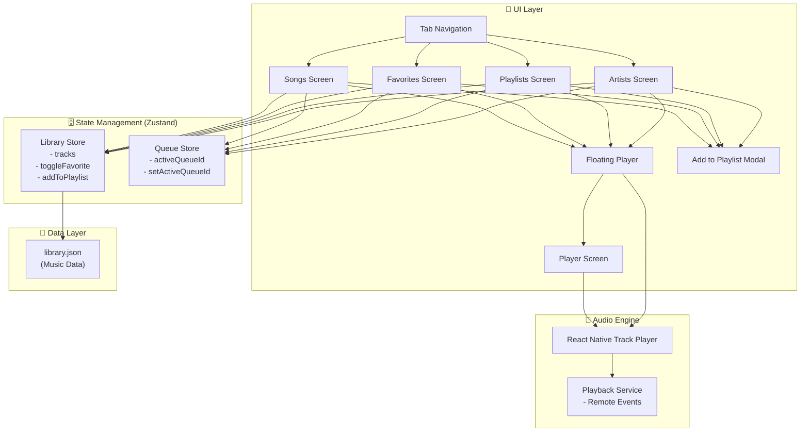
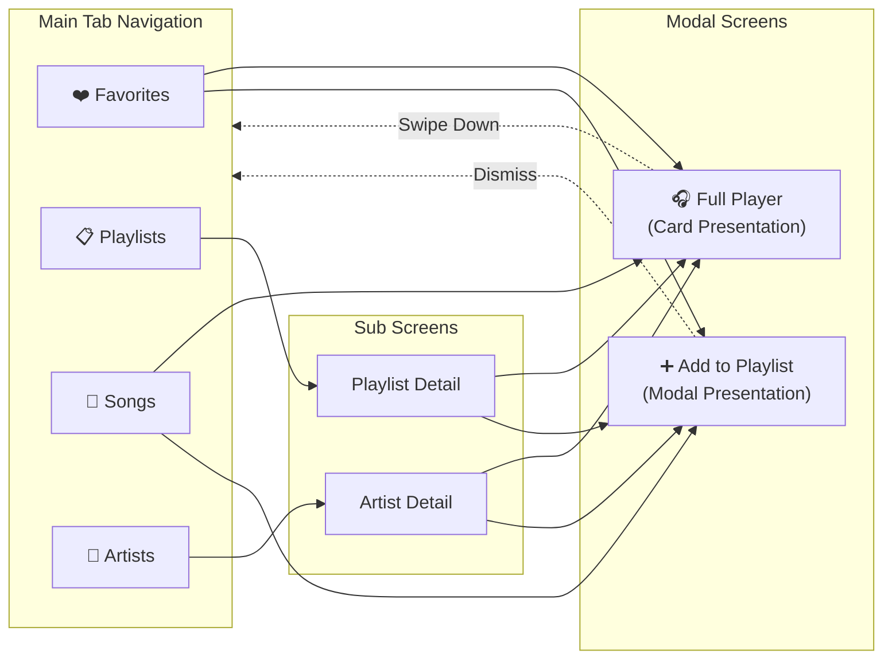
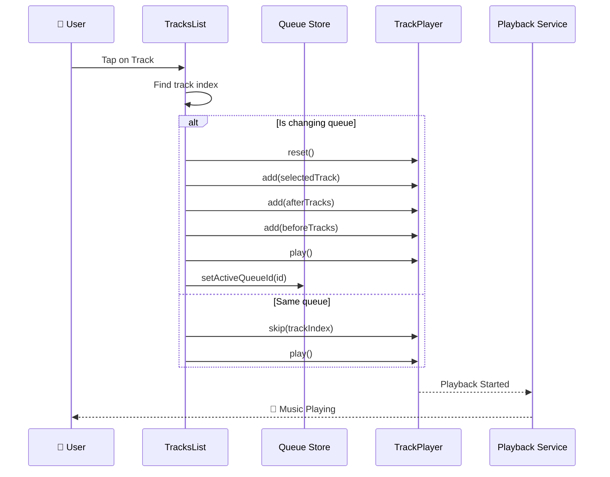
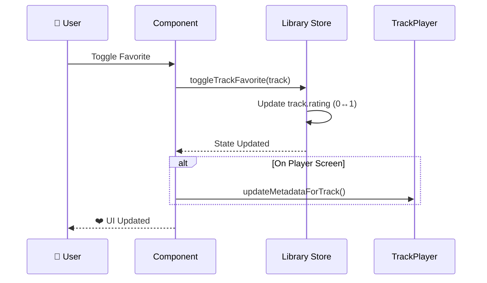
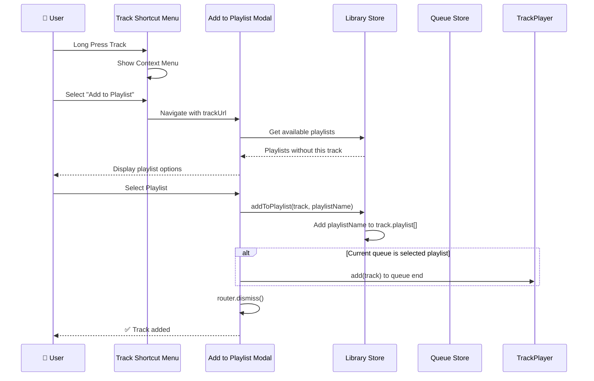
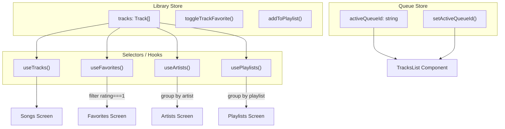
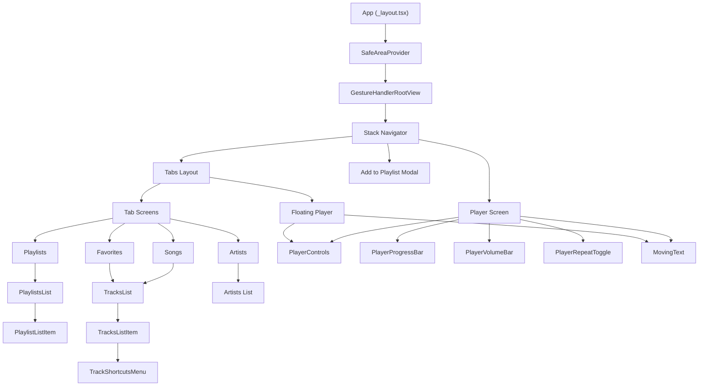
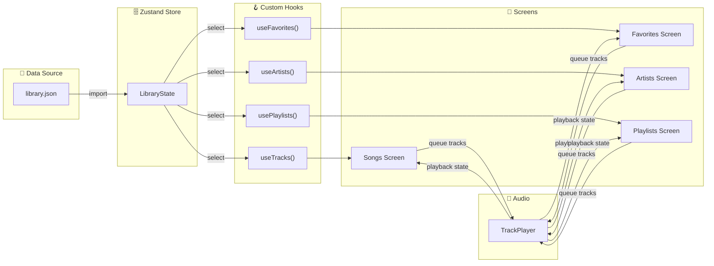
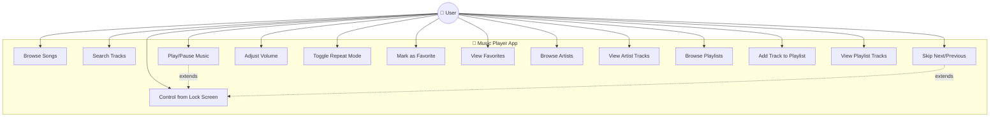

# Music Player - Workflow Diagrams

## 1. Sơ đồ Kiến trúc Tổng quan (System Architecture)



## 2. Luồng Điều hướng (Navigation Flow)



## 3. Luồng Phát nhạc (Music Playback Flow)



## 4. Luồng Quản lý Yêu thích (Favorite Management Flow)



## 5. Luồng Thêm vào Playlist (Add to Playlist Flow)



## 6. Luồng Khởi tạo App (App Initialization Flow)

```mermaid
flowchart TB
    Start([App Launch]) --> Splash[Show Splash Screen]
    Splash --> Register[Register Playback Service]
    Register --> Setup[Setup TrackPlayer]
    
    Setup --> Config[Configure Player:\n- Cache: 10MB\n- Rating: Heart\n- Capabilities]
    Config --> Volume[Set Volume: 30%]
    Volume --> Repeat[Set Repeat: Queue]
    
    Repeat --> Hide[Hide Splash Screen]
    Hide --> Ready([App Ready])
    
    subgraph PlaybackService["Playback Service Events"]
        E1[RemotePlay → play()]
        E2[RemotePause → pause()]
        E3[RemoteStop → stop()]
        E4[RemoteNext → skipToNext()]
        E5[RemotePrevious → skipToPrevious()]
    end
    
    Register -.-> PlaybackService
```

## 7. Sơ đồ State Management (State Flow)



## 8. Sơ đồ Components (Component Hierarchy)



## 9. Sơ đồ Data Flow (Luồng dữ liệu)



## 10. Use Case Diagram



---

## Hướng dẫn sử dụng Diagrams

### Cách render Mermaid diagrams:

1. **GitHub/GitLab**: Copy code vào file `.md`, diagrams sẽ tự render
2. **VS Code**: Cài extension "Mermaid Preview" 
3. **Online**: Dùng [Mermaid Live Editor](https://mermaid.live/)
4. **Export PNG/SVG**: Dùng Mermaid CLI hoặc Live Editor

### Cách chèn vào báo cáo Word/PDF:
1. Mở Mermaid Live Editor
2. Paste code diagram
3. Export ra PNG/SVG
4. Chèn hình vào báo cáo

---

*Generated for Music Player React Native Project*

